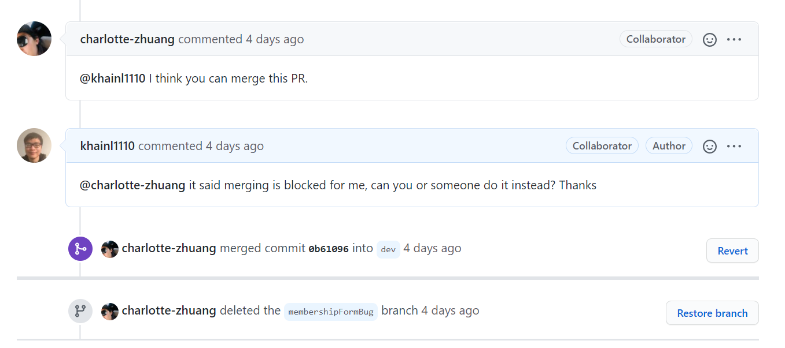

## Welcome to my portfolio


### SCE DEV Team work
#### Task: Implement Discord-like roles for the website called tags. 
Before: the website used a membership status like Member, Officer, Admin, Ban, etc to designated the accounts. This membership status also used as an access check for certain parts of the website. For ex, Member cannot access Admin portal. However, we want something like Discord roles, user can subscribe to specific section of our club website while keeping the access level

Therefore we come up wih tags, user will have appropriate tags for who they are

Changes I made in the backend:
- Create tag schema with following attribute:
  + role, string of the tag
  + level, level of access, same idea with access level
  + color, for decoration purpose
  + users: [ObjectID of User schema]
- User schema:
  + tags: [ObjectID of tag schema]

The idea is to references tag objects by their id in user schema and vice versa. Then whenever we need to check for user's tag, we loop through user tags attribute and checking if their access level is high enough or they have that particular role to access that part of the website.

Since mongodb is not a relational database, doing references might not be a good database design.

Each tags will have different color like in Discord, I implemented a drop-down search bar for adding/removing tags: 


#### Task: Membership Application Bugs
Before: required new account to have password length greater than 8 but the system didn't explicitly tell users. In addition, the website didn't warn user when the let important fields empty such as their name and didn't check if their email was in correct format. As well as no confirm password section
 

After fixing the bugs, red texts will appear as user typing to warn them if they needs to fill all the details/requirements


After many changes, my PR got merged
<a href="https://github.com/SCE-Development/Core-v4/pull/675">PR Link</a> 


### Markdown

Markdown is a lightweight and easy-to-use syntax for styling your writing. It includes conventions for

```markdown
Syntax highlighted code block

# Header 1
## Header 2
### Header 3

- Bulleted
- List

1. Numbered
2. List

**Bold** and _Italic_ and `Code` text

[Link](url) and 
```

For more details see [GitHub Flavored Markdown](https://guides.github.com/features/mastering-markdown/).

### Jekyll Themes

Your Pages site will use the layout and styles from the Jekyll theme you have selected in your [repository settings](https://github.com/khainl1110/khainl1110.github.io/settings/pages). The name of this theme is saved in the Jekyll `_config.yml` configuration file.

### Support or Contact

Having trouble with Pages? Check out our [documentation](https://docs.github.com/categories/github-pages-basics/) or [contact support](https://support.github.com/contact) and we’ll help you sort it out.
